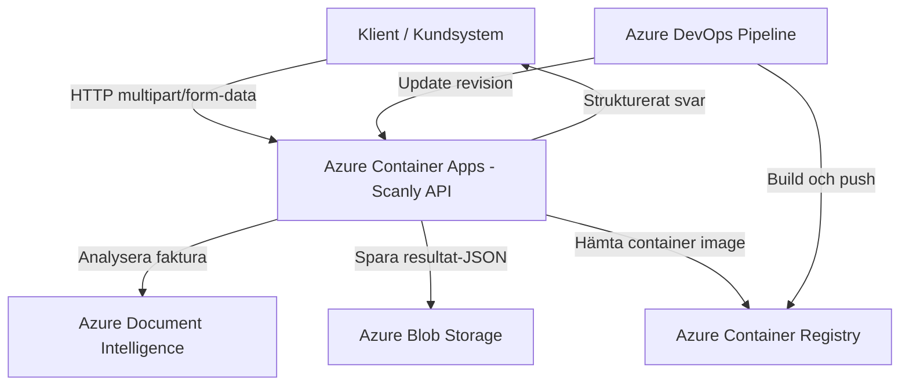

# Teknisk leveransrapport

**Uppdrag:** Scanly AB — Fakturaigenkänning som tjänst  
**Konsultteam:** Daniel Ränk och team  
**Datum:** 2026-09-25  
**Version:** 1.0

---

## Sammanfattning

Vi har levererat en molnbaserad plattform där Scanly AB kan ta emot fakturor via ett API och automatiskt analysera dem med Azure Document Intelligence. Kunden kan ladda upp en faktura och få tillbaka strukturerad data som leverantör, totalbelopp, förfallodatum, valuta och status. Lösningen är containeriserad, driftsatt i Azure Container Apps och byggd med infrastruktur som kod för att kunna återskapas och vidareutvecklas på ett kontrollerat sätt.

---

## Vad som levereras

### Inkluderat i leveransen

| Komponent | Teknisk lösning | Status |
| --- | --- | --- |
| REST API | .NET 10 Minimal API med endpoints för hälsa, uppladdning, hämtning och listning av fakturor | ✅ Levererat |
| Containerisering | Docker multi-stage build med runtime på port 8080 | ✅ Levererat |
| Driftsättning | Azure Container Apps | ✅ Levererat |
| Container image-register | Azure Container Registry | ✅ Levererat |
| Fillagring | Azure Blob Storage för resultat-JSON | ✅ Levererat |
| AI-analys | Azure Document Intelligence, prebuilt invoice-modell | ✅ Levererat i API |
| Infrastruktur som kod | Bicep med `main.bicep`, moduler och separata parameterfiler för stage/prod | ✅ Levererat |
| Automatiserad driftsättning | Azure DevOps YAML-pipeline i `ci_cd.yaml` | ✅ Levererat |
| API-dokumentation | Swagger UI via `/swagger` | ✅ Levererat |
| Hälsokontroll | `GET /health` | ✅ Levererat |

### Utanför leveransens scope

Följande punkter identifierades under uppdraget men ingår inte fullt ut i denna leverans. De rekommenderas som nästa steg.

| Punkt | Motivering |
| --- | --- |
| Produktionsgodkänd autentisering för slutanvändare | API:et är exponerat via extern ingress och behöver kundinloggning eller API-nyckel innan offentlig lansering. |
| API Management och rate limiting | Behövs för att skydda tjänsten mot överbelastning, felaktig användning och oväntade kostnadstoppar. |
| Application Insights och alert-regler | Loggar kan ses via Container Apps, men produktion bör ha samlad övervakning, spårning och larm. |
| Disaster recovery-plan | Prod använder mer robust storage-SKU än stage, men återställningsrutiner och RTO/RPO behöver definieras. |
| Full automatisering av Document Intelligence-resursen | API:et stödjer Document Intelligence, men endpoint/nyckel eller Managed Identity-konfiguration behöver säkras som en del av produktionsflödet. |

---

## Arkitektur

### Systemdiagram

### Motiverade arkitekturval

**Varför Azure Container Apps och inte AKS?**  
Azure Container Apps är ett aktivt val eftersom lösningen består av ett containeriserat API som behöver kunna driftsättas enkelt, köras kostnadseffektivt och skalas utan att kunden behöver förvalta ett Kubernetes-kluster. AKS ger mer kontroll över nätverk, noder och orkestrering, men det innebär också mer driftansvar. För Scanly AB:s scenario är det viktigare att snabbt kunna leverera en stabil tjänst med låg komplexitet än att bygga en plattform som kräver ett dedikerat driftteam.

**Varför Bicep och inte manuell konfiguration?**  
Bicep gör infrastrukturen reproducerbar och spårbar. I stället för att klicka fram resurser i portalen beskrivs önskat läge i kod, exempelvis Container App, ACR, Storage Account och rolltilldelningar. Det gör också att stage och prod kan skapas på samma sätt men med olika parametrar, till exempel CPU, minne, antal repliker och storage-SKU.

**Varför Azure Blob Storage för fillagring?**  
Blob Storage passar eftersom tjänsten främst behöver spara små resultatfiler i JSON-format efter fakturaanalysen. Det är billigt, skalbart och enkelt att integrera med .NET SDK. I lösningen används Managed Identity och rollen Storage Blob Data Contributor, vilket gör att API:et kan skriva till lagringen utan hårdkodade lagringsnycklar.

---

## Säkerhetsarkitektur

### Identitet och åtkomst

| Resurs | Åtkomstkontroll |
| --- | --- |
| Azure Container Apps | System-assigned Managed Identity |
| Azure Container Registry | RBAC via AcrPull till Container Appens Managed Identity |
| Azure Blob Storage | RBAC via Storage Blob Data Contributor till Container Appens Managed Identity |
| Azure Document Intelligence | Stöd för API-nyckel eller Managed Identity via DefaultAzureCredential |
| Pipeline-credentials | Azure DevOps service connection mot Azure |
| Container Registry admin user | Avstängd i Bicep |

### Hemlighetshantering

Inga credentials ska lagras i källkod eller git-historik. API:et läser konfiguration via miljövariabler som `AZURE_DI_ENDPOINT`, `AZURE_DI_KEY` och `AZURE_STORAGE_URL`. För produktion bör `AZURE_DI_KEY` fasas ut om Managed Identity kan användas fullt ut, eftersom det minskar beroendet av roterbara nycklar.

### Kvarvarande risker

| Risk | Sannolikhet | Åtgärd |
| --- | --- | --- |
| API saknar produktionsgodkänd slutanvändarautentisering | Hög | Implementera Entra ID Easy Auth, API-nyckel per kund eller API Management innan publik lansering. |
| Ingen rate limiting på uppladdnings-endpoint | Medel | Lägg till API Management eller throttling-regler för POST `/invoices`. |
| Kostnader kan öka vid många fakturasidor | Medel | Sätt budget-alerts och följ upp antal analyserade sidor per kund. |
| Begränsad observability | Medel | Koppla Application Insights och skapa larm på felprocent, svarstid och misslyckade analyser. |
| Stage och prod delar liknande processer men behöver tydligare separering | Medel | Kör separata resurser, parameterfiler, secrets och releaseflöden för varje miljö. |

---

## Kostnadskalkyl

### Månadskostnad vid lansering

Beräkningen bygger på antagandet att stage och prod kör sina minsta antal repliker dygnet runt, 730 timmar per månad. Växelkursen är avrundad till 1 USD = 10,50 kr. Scenario för lansering: 30 kunder och cirka 15 000 fakturasidor per månad.

| Resurs | SKU / antagande | Uppskattad kostnad/mån |
| --- | --- | --- |
| Container Apps stage | 0,25 vCPU / 0,5 GiB, 1 replik | ca 150 kr |
| Container Apps prod | 0,5 vCPU / 1 GiB, minst 1 replik | ca 301 kr |
| Azure Container Registry | Basic för stage och Standard för prod | ca 271 kr |
| Azure Blob Storage | 10 GB Hot ZRS, resultat-JSON | ca 2 kr |
| Azure Document Intelligence | Cirka 15 000 analyserade fakturasidor | ca 1 470 kr |
| Azure DevOps | Basic för mindre team | 0 kr |
| **Totalt** | Fast drift + AI-analys | **ca 2 194 kr/mån** |

Den fasta infrastrukturen utan Document Intelligence är cirka 724 kr per månad. Den rörliga kostnaden drivs främst av antalet fakturasidor som analyseras.

### Skalningspunkt

Den mest sannolika flaskhalsen är inte Blob Storage, utan API:ets kapacitet och kostnaden för Document Intelligence när antalet uppladdade fakturor ökar. Prod är satt till 0,5 vCPU, 1 GiB minne och max 5 repliker, vilket betyder att Container Apps kan skala horisontellt upp till den gränsen. När fler fakturor laddas upp samtidigt kan svarstiden öka, särskilt eftersom analysen väntar på att Document Intelligence ska slutföra jobbet. För att skala vidare bör maxReplicas höjas, CPU/minne justeras och analysflödet eventuellt göras asynkront med köhantering.

---

## Rekommendationer inför produktionssättning

1. **Autentisering för slutanvändare** — Implementera Entra ID Easy Auth eller API-nyckel per kund innan offentlig lansering.
2. **Monitoring** — Koppla Application Insights och sätt upp alert vid fel över 5 % eller svarstid över 2 sekunder.
3. **Tydligare miljöseparering** — Fortsätt använda separata Bicep-parameterfiler för stage och prod, men separera även secrets, releaseflöden och eventuella Document Intelligence-resurser.
4. **Kostnadslarm** — Sätt budget-alert i Azure Cost Management vid 80 % av månadsbudget.
5. **API Management** — Lägg till central hantering för autentisering, rate limiting, kundspecifika nycklar och framtida versionering.
6. **Asynkront analysflöde** — Vid högre volym bör uppladdning och AI-analys separeras med kö, så att API:et inte behöver hålla begäran öppen under hela analysen.
7. **Produktionshärdning av lagring** — Säkerställ lifecycle-regler, backupstrategi och tydlig retention för sparade analysresultat.
8. **Test och release-gates** — Lägg till automatiska tester, health check efter deployment och stopp om ny revision inte svarar korrekt.

---

## Överlämning

| Leverabel | Plats |
| --- | --- |
| Källkod | <https://github.com/danirank/ScanlyAB> |
| Bicep-mallar | `/Infra/` i repot |
| Bicep huvudfil | `/Infra/main.bicep` |
| Miljöparametrar | `/Infra/stage.bicepparam` och `/Infra/prod.bicepparam` |
| Bicep-moduler | `/Infra/modules/` |
| API-kod | `/ScanlyApi/Program.cs` |
| Dockerfile | `/ScanlyApi/Dockerfile` |
| Pipeline-definition | `/ci_cd.yaml` |
| API-dokumentation | `https://[container-app-url]/swagger` |
| Hälsokontroll | `https://[container-app-url]/health` |
| Denna rapport | `RAPPORT.md` i repots rot |
